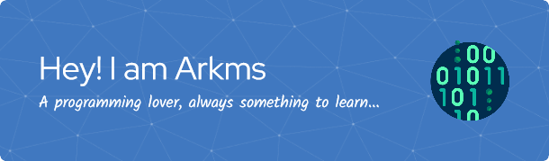

- 🌱 I’m currently learning **Vulkan**

- 👨‍💻 All of my projects are available at [https://arjierdagames.com/arkms/](https://arjierdagames.com/arkms/)

- 💬 Ask me about **Video games, code, movies and technology.**

<h3 align="left">Connect with me:</h3>

  <a href="https://twitter.com/arkms0" target="_blank">
    <code></code>
  </a>
  <a href="https://linkedin.com/in/arkms" target="_blank">
    <code></code>
  </a>

<h3 align="left" >Code Languages:</h3>

  <a href="https://www.w3schools.com/cs/" target="_blank" rel="noreferrer">
    <code></code>
  </a>
  <a href="https://www.w3schools.com/cpp/" target="_blank" rel="noreferrer">
    <code></code>
  </a>
  <a href="https://developer.mozilla.org/en-US/docs/Web/JavaScript" target="_blank" rel="noreferrer">
    <code></code>
  </a>
  <a href="https://www.java.com" target="_blank" rel="noreferrer">
    <code></code>
  </a>
  <a href="https://www.php.net" target="_blank" rel="noreferrer">
    <code></code>
  </a>
  <a href="https://www.python.org" target="_blank" rel="noreferrer">
    <code></code>
  </a>
  <a href="https://www.gnu.org/software/bash/" target="_blank" rel="noreferrer">
    <code></code>
  </a>
  <a href="https://www.typescriptlang.org/" target="_blank" rel="noreferrer">
    <code></code>
  </a>
  <a href="https://www.w3schools.com/css/" target="_blank" rel="noreferrer">
    <code></code>
  </a>
  <a href="https://www.w3.org/html/" target="_blank" rel="noreferrer">
    <code></code>
  </a>

<h3 align="left">Developer Tools:</h3>

  <a href="https://unity.com/" rel="noreferrer">
    <code></code>
  </a>
  <a href="https://developer.android.com" rel="noreferrer">
    <code></code>
  </a>
  <a href="https://codeigniter.com" rel="noreferrer">
    <code></code>
  </a>
  <a href="https://www.linux.org/" rel="noreferrer">
    <code></code>
  </a>
  <a href="https://cordova.apache.org/" rel="noreferrer">
    <code></code>
  </a>
  <a href="https://www.arduino.cc/" rel="noreferrer">
    <code></code>
  </a>
  <a href="https://reactjs.org/" rel="noreferrer">
    <code></code>
  </a>
  <a href="https://getbootstrap.com" rel="noreferrer">
    <code></code>
  </a>
  <a href="https://nodejs.org" rel="noreferrer">
    <code></code>
  </a>
  <a href="https://dotnet.microsoft.com/" rel="noreferrer">
    <code></code>
  </a>
  <a href="https://www.mysql.com/" rel="noreferrer">
    <code></code>
  </a>
  <a href="https://www.mongodb.com/" rel="noreferrer">
    <code></code>
  </a>
  <a href="https://www.sqlite.org/" rel="noreferrer">
    <code></code>
  </a>
  <a href="https://www.chartjs.org" rel="noreferrer">
    <code></code>
  </a>
  <a href="https://angular.io" rel="noreferrer">
    <code></code>
  </a>
  <a href="https://angular.io" rel="noreferrer">
    <code></code>
  </a>
  <a href="https://expressjs.com" rel="noreferrer">
    <code></code>
  </a>
  <a href="https://git-scm.com/" rel="noreferrer">
    <code></code>
  </a>
  <a href="https://opencv.org/" rel="noreferrer">
    <code></code>
  </a>
  <a href="https://postman.com" rel="noreferrer">
    <code></code>
  </a>
  <a href="https://www.selenium.dev" rel="noreferrer">
    <code></code>
  </a>
  <a href="https://www.blender.org/" target="_blank" rel="noreferrer">
    <code></code>
  </a>

<h3 align="left">Web services:</h3>

  <a href="https://aws.amazon.com" rel="noreferrer">
    <code></code>
  </a>
  <a href="https://azure.microsoft.com/en-ca" rel="noreferrer">
    <code></code>
  </a>
  <a href="https://heroku.com" rel="noreferrer">
    <code></code>
  </a>
  <a href="https://edgegap.com" rel="noreferrer">
    <code></code>
  </a>
  <a href="https://developer.playfab.com" rel="noreferrer">
    <code></code>
  </a>

